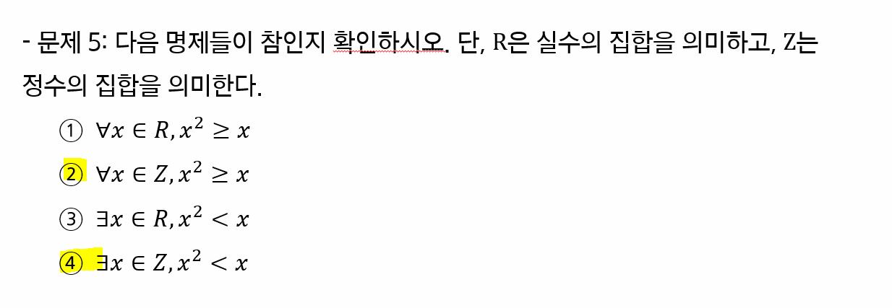

# 논리와 증명

> 함께 학습하고 고민하고 설명하며 작은 부분 하나라도 '내 것'으로 만들어보세요. 😁


### **이 과정은 왜 배우냐면요..1️⃣**

1. 컴퓨터공학에서 어떤 주제로 학습 하는지 경험해 볼 수 있습니다.
   - 하루만에 이 모든 지식을 다 내것으로 만들 수는 없지만 추후 학습의 작은 트리거가 될 수 있습니다. 
2. 문제를 풀 때 단순하게 느낌에 의존하는 것이 아닌 명확한 근거를 기반으로 사고하는 것이 어떤 것인지 체험해 볼 수 있습니다.
3. 개발자가 되기 위해 필요한 제반 지식을 얻을 수 있습니다.


### **아래의 규칙을 지켜주세요.. 2️⃣**

1. 학습한 내용을 수기 작성, 테블릿 등을 활용하여 작성해 주시고 결과를 이미지로 첨부해주세요.

   - 물론 마크다운 등을 활용하여 결과를 작성해도 됩니다.

2. 모르는 내용이 나오면 팀원과 함께 자료를 찾아가면 공부해보세요.

   - '학습' 그 자체에 초점을 맞춰서 공부해보세요. 생각보다 많은 것을 얻어갈 수 있을거에요.

   - 조 별로 궁금한 내용을 서로 물어보고 찾아가며 함께 만들어가요.

3. 아래와 같은 순서로 학습하시는 것을 추천합니다.

   1. 교재를 기반으로 1차 학습

      - 한 문제 한 문제 같이 풀어보며 정답 작성하기

      - 중간에 풀리지 않는 문제 등은 빠르게 넘어가기

   2. 모든 문제를 다 풀고 풀리지 않는 문제로 돌아와서 2차 학습
      - 교재로 해결되지 않는 부분은 구글링을 통해 해결
      - 다른 조와의 협업을 통해서도 해결 가능

4. 최종 풀이 완료 이후 **조 별 하나의 공동 문서를 작성하며 정리**


### 모든 문제를 푸셨다면..3️⃣

1. 조 별 완성본 파일이 담긴 1개의 폴더 준비

   - 조장이 `1_논리와 증명.md` 파일 최상단에 조장 & 조원 명단 작성

2. 조장이 오늘 날짜(`0928`) 폴더 만들어서 PR 보내기

   - 조장만 진행

   - 조 별 완성본은 1개만 제출

   - PR 폴더 구조

     ```
     ...
     0926/
     	...
     0927/
     	...
     0928/
     	1조/ # 폴더
     		1_논리와 증명.md
     		2_수와 표현.md 
     		...
     	2조/
     		1_논리와 증명.md
     		2_수와 표현.md 
     		...
     	3조/
     		1_논리와 증명.md
     		2_수와 표현.md 
     		...
     	...
     ```

     

### **참고 사이트는요.. 4️⃣**

https://www.desmos.com/calculator?lang=ko

https://www.wolframalpha.com/


## 1-2 번

                              

| p    | q    | ~p   | (~p V q) | ~q   | (p ^ ~q) | (~p v q ) V (p ^ ~q) |
| ---- | ---- | ---- | -------- | ---- | -------- | -------------------- |
| T    | T    | F    | T        | F    | F        | **T**                |
| T    | F    | F    | F        | T    | T        | **T**                |
| F    | T    | T    | T        | F    | F        | **T**                |
| F    | F    | T    | T        | T    | F        | **T**                |


## 2-2 번  


| p    | q    | ~q   | (p ^ q) | (p ^ ~q) | (p ^ q) ^ (p ^ ~q) |
| ---- | ---- | ---- | ------- | -------- | ------------------ |
| T    | T    | F    | T       | F        | **F**              |
| T    | F    | T    | F       | T        | **F**              |
| F    | T    | F    | F       | F        | **F**              |
| F    | F    | T    | F       | F        | **F**              |


## 3-2 번


| ~p   | ~q   | ~p v ~q | p    | q    | (p v q) | ~(p v q) |
| ---- | ---- | ------- | ---- | ---- | ------- | -------- |
| F    | F    | **F**   | T    | T    | T       | **F**    |
| F    | T    | **T**   | T    | F    | T       | **F**    |
| T    | F    | **T**   | F    | T    | T       | **F**    |
| T    | T    | **T**   | F    | F    | F       | **T**    |


## 4-2 번


`(p v ~q) ^ (~p v ~q)` = `(~q v p ) ^ (~q v ~p)` = `~q v (p ^ ~p)` = `~q v ∅ `


## 5-2 번 & 5-4번



**5-2번**
$$
\forall x \in Z, x^2 \geq x
$$
해당 명제를 만족하지 않는 x의  `0 < x < 1`인데, 해당 범위엔 정수 값이 존재하지 않는다. 다시 말해 모든 정수 `x`에 대해 부등식 `x^2 >= x`을 만족한다고 할 수 있다. 따라서 ② 명제는 참이다.


**5-4번**
$$
\exists \in Z, x^2 < x
$$
`x^2 < x, x^2-x < 0, x(x-1) < 0`이므로, 가 된다. 이때, `0 < x < 1`해당 부등식 조건을 만족하는 어떤 정수도 존재하지 않는다. 따라서 ④ 명제는 거짓이다.


# 7번


$$
n = 2k + 1일때, \\

n^2 + n = (2k + 1)^2 + (2k + 1) = 4k^2 + 4k + 1 + 2 + 1 = 4k^2 + 4k + 4 = 2(2k^2 + 2k + 2)이다. \\
 
그러므로 n^2 + n 은 짝수이다.
$$


## 9번


주어진 본 명제 대신 대우를 증명하여 본 명제가 참임을 증명하는 간접 증명을 활용해보자

대우명제: `n`이 홀수이면 `n^2 + 5` 은 짝수이다.
$$
n = 2k + 1 일때, n^2 + 5 = (2k + 1)^2 + 5 = 4k^2 + 4k + 6 = 2(2k^2 + 2k + 3)
$$
위와 같은 이유로 `n`이 홀수이면, `n^2 + 5`는 짝수이다. 대우 명제가 참이기 때문에, 본 명제 또한 참이다.


## 10번


간접 증명을 활용해보자

대우명제: `n`이 홀수이면 `n^2`이 홀수이다. 
$$
n = 2k + 1일 때, n^2 = (2k + 1)^2 = 4k^2 + 4k + 1 =2(2k^2 + 2k) + 1
$$
이므로 `n`이 홀수이면 `n^2`은 홀수이다. 대우 명제가 참이기 때문에 본 명제 또한 참이다.


## 11번


**n이 짝수인 경우**
$$
n = 2k, n^2 + 5n + 3 = (2k)^2 + 5(2k) + 3 = 4k^2 + 10k + 3 = 2(2k^2 + 5k + 1) + 1
$$
그러므로, n이 짝수인 경우 `n^2 + 5n + 3`은 항상 홀수이다.


**n이 홀수인 경우**
$$
n = 2k + 1, n^2 + 5n + 3 = (2k + 1)^2 + 5(2k + 1) + 3 = 4k^2 + 14k + 9 = 2(2k^2 + 7k + 4) + 1
$$
그러므로, n이 홀수인 경우 `n^2 + 5n + 3`은 항상 홀수이다.


**결론**

n이 짝수인 경우와 홀수인 경우 모두  `n^2 + 5n + 3`은 항상 홀수이므로, 자연수 n에 대해 `n^2 + 5n + 3`은 항상 홀수이다.


## 12번


주어진 명제의 대우 명제는 다음과 같다.

대우 명제: n이 3의 배수가 아니면 `n^2`은 3의 배수가 아니다.


**`n = 3k + 1`** 
$$
n = 3k + 1일때, n^2 = (3k + 1)^2 = 9k^2 + 6k + 1 = 3(3k^2 + 2k) + 1
$$
이므로 3의 배수가 아니다.


**`n = 3k + 2`**
$$
n^2 = (3k + 2)^2 = 9k^2 + 12k + 4 = 3(3k^2 + 4k + 1) + 1
$$
이므로 3의 배수가 아니다.


**결론**

따라서, n이 3의 배수가 아니면 `n^2`은 3의 배수가 아니다.

대우 명제가 참이기 때문에 본 명제 또한 참이다. 

