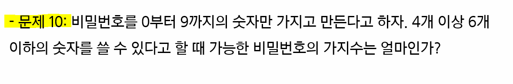
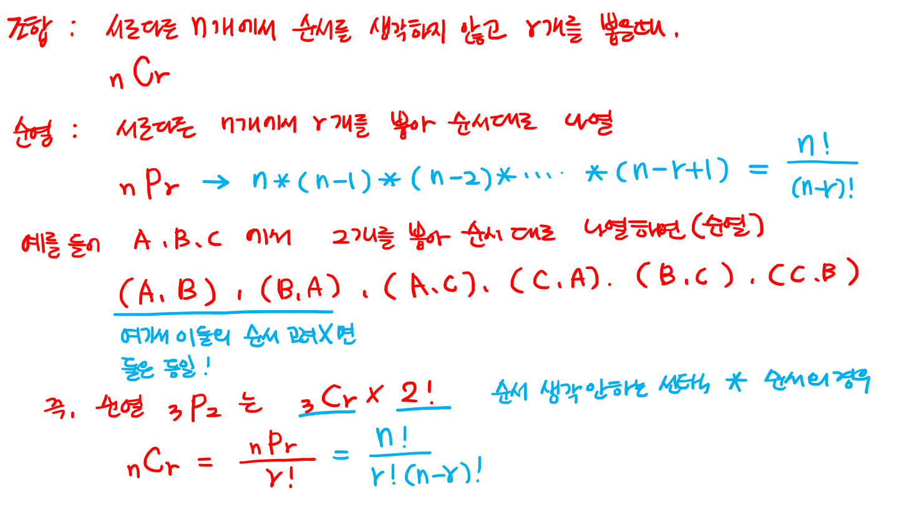

# 집합과 조합

> 함께 학습하고 고민하고 설명하며 작은 부분 하나라도 '내 것'으로 만들어보세요. 😁

## 3 번

$$
부분\ 집합의\ 원소의 \ 개수를 \ 총 \ n개라고 \ 했을 \ 때 \\
원소의 \ 개수가 \ 0 개인 \ 부분집합의 수: \binom{n} {0} \\
원소의 \ 개수가 \ 1 개인 \ 부분집합의 수: \binom{n} {1} \\
원소의 \ 개수가 \ 2 개인 \ 부분집합의 수: \binom{n} {2} \\

... \\

원소의 \ 개수가 \ n 개인 \ 부분집합의 수: \binom{n} {n} \\
원소의 \ 개수가 \ n \ 개일 때 ,총 \ 부분집합의 수 \ S는 \binom{n} {0} + \binom{n} {1} + \binom{n} {2} + ... + \binom{n} {n}이다. \\ 

S = \binom{n} {0} +\binom{n} {1} +\binom{n} {2} +...+ \binom{n} {n} =\sum_{n=0}^{n} 1^ {n-k}1^k = (1 + 1)^n = 2^n이므로 \ n개의 \ 원소를 \ 가진 \ 집합의 \ 가능한 \ 부분집합의 \ 종류는 \ 2^n개이다.
$$

## 10 번

$$
가능한 \ 비밀번호는 \ 숫자가 \ 4개, 5개, 6개가 들어 갈 경우이다. \\ 
숫자가 \ 4개 \ 사용 \ 될 \ 경우: \ 10 \times 9 \times 8 \times 7 = 5,040 \\
숫자가 \ 5개 \ 사용 \ 될 \ 경우: \ 10 \times 9 \times 8 \times 7 \times 6 = 30,240 \\
숫자가 \ 6개 \ 사용 \ 될 \ 경우: \ 10 \times 9 \times 8 \times 7 \times 6 \times 5 = 151, 200 \\

따라서 \ 총 \ 가능한 \ 비밀번호의 \ 가지 \ 수는 \ 186,480개 \ 이다.
$$

## 13 번

$$
무늬의 \ 종류는 \ 4가지이고,\ 이 \ 중 \ 하나를 \ 선택하는 \ 경우는 \ \binom{4} {1} \ 가지이다. \\
그리고 \ 같은 \ 무늬일 \ 때, \ 서로 \ 다른 \ 숫자를 \ 뽑는 \ 경우는 \ 13 \ 개 \ 중 \ 3개를 \ 뽑는 \ 경우 \binom {13} {3}이다. \\

나머지 \ 2개의 \ 카드는 \ 무늬가 \ 달라야 \ 하므로, \ 나머지 \ 3개에서 \ 2개를 \ 뽑는 \ \binom{3} {2}가지이고, \ 수는 \ 서로 \ 상관없으므로 \ \binom{13} {1} \times \binon{13} {1}이다. \\

따라서 \ 이들을 \ 모두 \ 곱하면, \\
(\binom{4} {1} \times \binom{13} {3}) \times \ (\binom{3} {2} \times \binom{13} {1} \times \binom{13} {1}) = 580, 008 가지가 \ 된다.
$$

## 16 번

$$
스페이드, \ 하트, \ 다이아몬드, \ 클로버 -> \ 각 \ 무늬 \ 별로 \ A부터 \ J, K, Q까지 \ 13장의 카드 \\ 총 \ 52장의 \ 카드 \\

1) \ 52장의 \ 카드에서 \ 1장을 고른다. \binom {52} {1} \\
2) \ 1)에서 \ 뽑은 \ 숫자와 \ 같은 \ 카드 \ 4장을 \ 제외한 \ 48장의 \ 카드에서 \ 1장 \ 고르고 \ \binom {48} {1} \\ 
3) \ 같은 \ 방식으로 \ 3번 \ 수행 \ \binom {44} {1} \ \binom {40} {1} \ \binom {36} {1} \\
4) \ (1)에서 \ (3)까지 \ 모두 \ 곱하고 \ 고른 \ 순서에 \ 의해 \ 구분되는 \ 경우 \ 제외 \\

\frac {52 \times 48 \times 44 \times 40 \times \ 36} {5!} \\

최종 결과는 \ 1, 317, 888
$$

**정리 예시**

