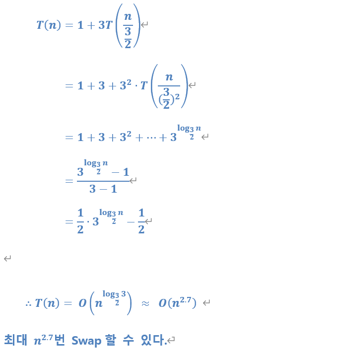

# 재귀

> 함께 학습하고 고민하고 설명하며 작은 부분 하나라도 '내 것'으로 만들어보세요. 😁

## 2번 - Merge Sort Time Complexity Proof

- Merge Sort가 진행되는 과정을 직접 그려보고 각 단계에서 어떤 일이 일어나는지 생각해보세요.
- 기초 수식에서 학습한 재귀식으로 표현하면 어떻게 되는지 같이 생각해보세요.

`n`개의 정수에 대해 병합정렬하는데 걸리는 시간을 `T(n)` 이라고 하자.

이때, 병합정렬은 

1. 좌측 절반 정렬 => $T(n/2)$
2. 우측 절반 정렬 => $T(n/2)$
3. 좌/우측 정렬결과 합치기(병합) => $n$

으로 구성되어 있다.

$$
\begin{align*}
T(n) &= T(n/2) + T(n/2) + n \\
&= 2\times T(n/2) + n
\end{align*}
$$

절반을 정렬하는데 걸리는 시간을 아래 식으로 표현 가능
$$
\begin{align*}

T(n/2) &= T(n/4) + T(n/4) + n/2 \\
&= 2\times T(n/2^2) + n/2
\end{align*}
$$

이때, $T(n/2)$를 치환하여 $T(n)$을 다시 작성
$$
\begin{align*}
T(n) &= 2\times T(n/2) + n\\
&= 2\times\{2\times T(n/2^2) + n/2\} + n\\
&= 2^2\times T(n/2^2) + 2n
\end{align*}
$$
---

이번에는 절반의 절반을 정렬하는데 걸리는 시간을 식으로 표현 ($T(n/4) = T(n/2^2)$)
$$
\begin{align*}
T(n/2^2) &= T(n/8) + T(n/8) + n/4\\
&= 2\times T(n/2^3) + n/2^2
\end{align*}
$$

한번더 $T(n/2^2)$를 치환하여 $T(n)$을 재작성
$$
\begin{align*}
T(n) &= 2^2\times T(n/2^2) + 2n\\
&= 2^2\times \{2\times T(n/2^3) + n/2^2\} + 2n\\
&= 2^3\times T(n/2^3) + 3n
\end{align*}
$$

### 재귀식

위와 같이 $i$번 재귀를 반복할 경우, 아래와 같이 표현 가능
$$
\begin{align*}
T(n) &= 2^i\times T(n/2^i) + in
\end{align*}
$$

병합정렬의 기저조건(base case)은 `n == 1`이다. 만약 $i$번째 재귀함수에서 기저 조건에 도달했다면, 식은 아래와 같다.
$$
\begin{align*}
T(n) &= 2^i\times T(1) + in
\end{align*}
$$

이때, $i$와 $n$의 관계를 아래와 같이 재정의 할 수 있다.
$$
\begin{align*}
&n/2^i = 1\\
&n = 2^i\\
&i = \log_{2}n
\end{align*}
$$

모든 $i$를 $log_{2}n$으로 치환
$$
\begin{align*}
T(n) &= 2^{log_{2}n}\times T(1) + nlog_{2}n

\end{align*}
$$

기저조건인 $T(1)$의 시간복잡도는 $1$ 이다.
$$
\begin{align*}
T(1) &= 1
\end{align*}
$$

### 정리

$$
\begin{align*}
T(n) &= 2^{log_{2}n} \times 1+ nlog_{2}n\\
&= n + nlog_{2}n\\
\end{align*}
$$

### 시간 복잡도

그러므로 병합정렬의 시간복잡도 big-O 는 $O(n + nlog_{2}n) = O(nlog_{2}n)$이다.

## 4번 

## 참고자료

http://www.bowdoin.edu/~ltoma/teaching/cs231/fall16/Lectures/02-recurrences/recurrences.pdf

https://www.cs.princeton.edu/courses/archive/spr07/cos226/lectures/04MergeQuick.pdf