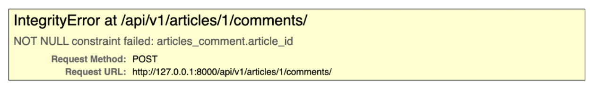

# REST API


## HTTP

* HyperText Transfer Protocol
* HTML 문서와 같은 리소스들을 가져올 수 있도록 하는 프로토콜(규칙, 약속)
* 웹에서 이루어지는 모든 데이터 교환의 기초
  * 요청(request) : 클라이언트에 의해 전송되는 메세지
    * Method, Path, Version of the protocol, Headers
  * 응답(response) : 서버에서 응답으로 전송되는 메세지가
    * Version of the protocol, Status code, Status message, Headers
* 기본 특성
  * Stateless
  * Connectless
* 쿠키와 세션을 통해 서버 상태를 요청과 연결하도록 함


## HTTP request methods

* 주어진 리소스(자원)에 수행하길 원하는 행동을 나타냄

  * GET, POST, PUT, DELETE

  ```
  # HTTP response status codes
  
  1. Informational responses (1xx)
  2. Succesful respondses (2xx)
  3. Redirection messages (3xx)
  4. Client error responses (4xx)
  5. Server error responses (5xx)
  ```


### URL, URN

* URI(Uniform Resource Identifier)
  *  일반적으로 URL은 URI와 같은 의미처럼 사용
  * URL(Uniform Resource Locator)
    * 통합 자원 위치
    * 네트워크 상에 자원이 어디 있는지 알려주기 위한 약속
    * '웹 주소', '링크'라고도 불림
  *  URN(Uniform Resource Name)
    * 통합 자원 이름
    * URL과 달리 자원의 위치에 영향을 받지않는 유일한 이름 역할
    * ex) ISBN(국제표준도서번호)


## API

* Application Programming Interface
* 프로그래밍 언어가 제공하는 기능을 수행할 수 있게 만든 인터페이스
  * CLI는 명령중, GUI는 그래픽(아이콘), API는 프로그래밍을 통해 특정한 기능 수행
* WEB API
  * 다른 서비스에 요청을 보내고 응답을 받기 위해 정의된 명세
  * 직접 개발보단 여러 Open API 활용
  * 응답 데이터 타입 : HTML, XML, JSON


## REST

* REpresentational State Transfer
* 네트워크 구조 원리의 모음
  * 자원을 정의하고 자원에 대한 주소를 지정하는 전반적인 방법
* REST의 자원과 주소의 지정 방법
  * 자원 : URI
  * 행위 : HTTP Method(GET, POST, PUT, DELETE)
  * 표현 : 결과물 - JSON으로 표현된 데이터를 제공

​	

### JSON

* JavaScript Object Notation

* JavaScript의 표기법을 따른 단순 문자열

* 특징

  * 사람이 읽거나 쓰기 쉽고 기계가 파싱(해석, 분석)하고 만들어내기 쉬움
  * 파이썬의 dictionary, 자바스크립트의 object처럼 C 계열의 언어가 갖고 있는 자료 구조로 쉽게 변화할 수 있는 key-value 형태의 구조를 가지고 있음


### Django REST Framework

```bash
$ pip install djangorestframework
```


```python
# settings.py
INSTALLED_APPS = [
    ...
    'rest_framework',
]
```


```python
# articles/serializers.py
from rest_framework import serializers
from .models import Article

class ArticleSerializer(serializers.ModelSerializer):
    
    class Meta:
        model = Article
        fields = '__all__'
```

##### ModelSerializer

- 모델 필드에 해당하는 필드가 있는 Serializer 클래스를 자동으로 만들 수 있는 shortcut
  1. 모델 정보에 맞춰 자동으로 필드 생성
  2. serializer에 대한 유효성 검사기를 자동으로 생성
  3. .creat(), .update()의 간단한 기본 구현 가능
  4. many=True
     - 단일 인스턴스 대신 QuerySet을 직렬화
- 1. Validation(C, U) : write
  2. 데이터의 구조를 결정(R) : Read


```python
# articles/views.py
from django.shortcuts import get_list_or_404

from rest_framework.decorators import api_view
from rest_framework.response import Response

from .serializers import ArticleSerializer

@api_view()
def article_json_3(request):
	articles = Article.objects.all()
    serializer = ArticleSerializer(articles, many=True)
    return Response(serializer.data)

@api_view(['GET','POST'])
def article_list(request):
    # 전체 게시글 조회
    if request.mehtod == 'GET':
        articles = get_list_or_404(Article)
        serializers = ArticlesSerializer(articles, many=True)
        return Response(serializer.data)
    # 게시글 생성
    if request.method == 'POST':
        serializer = ArticleSerializer(data=request.data)
        if serializer.is_valid(raise_exception=True):
            serializer.save()
            return Response(serializer.data, status=status.HTTP_201_CREATED)
        # return Response(serializer.error, status=status.HTTP_400_BADREQUEST)
```

##### api_view decorator

- 기본적으로는 GET 메서드만 허용되며 다른 메서드 용청에 대해서는 405 Method Not Allowed로 응답
- view 함수가 응답해야하는 HTTP 메서드의 목록을 리스트의 인자로 받음
- DRF에서는 **필수적으로 작성**


##### raise_exception

- error일 경우 status.HTTP_400_BADREQUEST을 발생


```python
# test.py
import requests
from pprint import pprint

response = requests.get('http://127.0.0.1:8000/api/v1/json-3/')
pprint(response.json())
# json file로 파싱해서 보여줌.
pprint(type(response.json()))
# list [{dict},{dict},{dict},]
pprint(response.json()[0])
# 데이터 접근 가능
```


---

## 1:N Relation


### Create Comment

- Article 생성과 달리 Comment 생성은 생성 시에 참조하는 모델의 객체 정보가 필요
- 1:N 관계에서 N은 어떤 1을 참조하는지에 대한 정보가 필요(외래키)



```python
# views.py

@api_view(['POST'])
def comment_create(request, article_pk):
	article = get_object_or_404(Article, pk=article_pk)
    serializer = CommentSerializer(data=request.data)
    if serializer.is_valid(raise_exception=True):
        serializer.save(article=article)
        return Response(serializer.data, status=status.HTTP_201_CREATED)
```

##### Read Only Field(읽기 전용 필드)

- 어떤 게시글에 작성하는 댓글인지에 대한 정보를 form-data로 넘겨주지 않기 때문에 직렬화하는 과정에서 article 필드가 유효성 검사(is_valid)를 통과하지 못함
- CommentSerializer에서 article field에 해당하는 데이터 또한 요청으로 부터 받아서 직렬화하는 것으로 설정되었기 때문
- 이때는 위 설정을 통해 직렬화하지 않고 반환 값에만 해당 필드가 포함되도록 설정할 수 있음


```python
# articles/serializers.py

class CommentSerializer(serializers.ModelSerializer):
    
    class Meta:
        model = Comment
        fields = '__all__'
        read_only_fields = ('article',)
```


### 특정 게시글에 작성된 댓글 목록 출력하기

##### case1) PrimaryKeyRelatedField

- pk를 사용하여 관계된 대상을 나타내는 데 사용할 수 있음
- 필드가 to many relationships(N)를 나타내는데 사용되는 경우 many=True 속성 필요
- comment_set 필드 값을 form-data로 받지 않으므로 read_only=True 설정 필요

```python 
# serializers.py

class ArticleSerializer(serializers.ModelSerializer):
    comment_set = serializers.PrimaryKeyRelatedField(many=True, read_only=True)
    
    class Meta():
        model = Article
        fields = '__all__'
```

